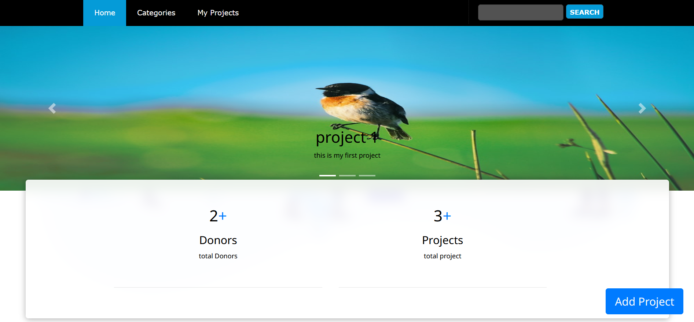
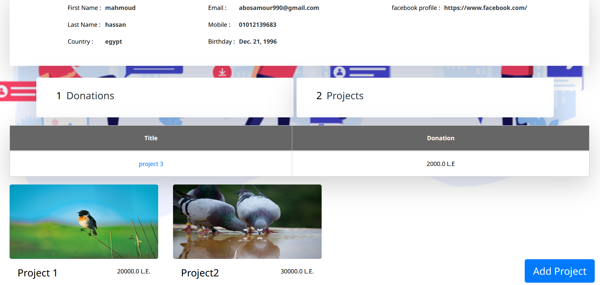
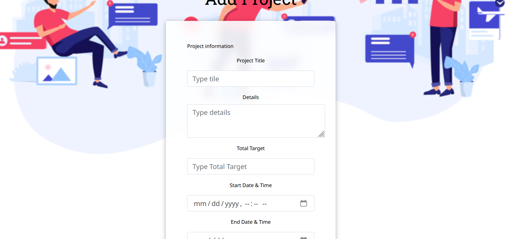
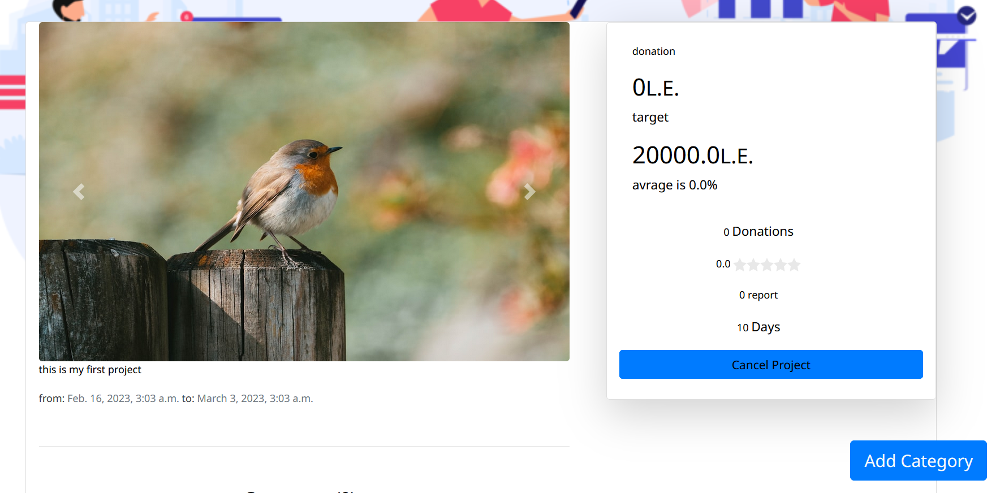
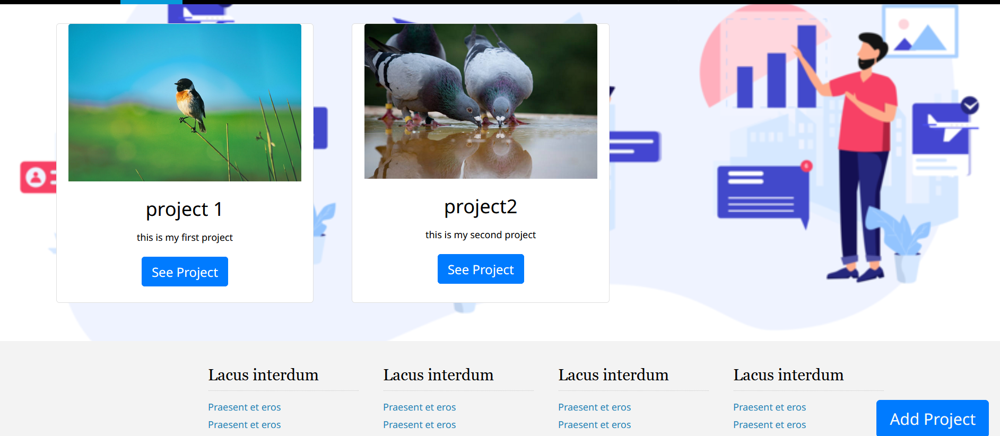
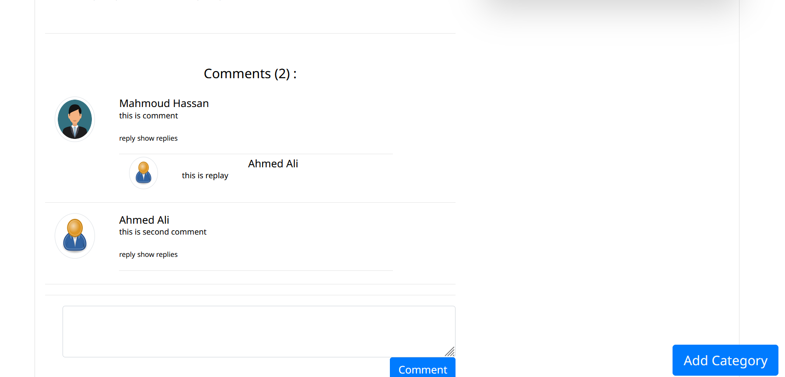

<h1>Crowd-Funding Web app</h1>

Crowdfunding is the practice of funding a project or venture by raising small
amounts of money from a large number of people, typically via the Internet.
Crowdfunding is a form of crowdsourcing and alternative finance

<h2>login</h2>

<h2>register</h2>

<h2>home Page</h2>

<h2>profile</h2>

<h2>add project</h2>

<h2>details project</h2>

<h2>search by title and tag and select category and show my projects</h2>

<h2>comments</h2>

<h1>authors:</h1>
<ol>
<li>Mahmoud hassan</li>
<li>Ahmed abdalnasser</li>
<li>Mahmoud ali</li>
<li>Mahmoud aboalhassan</li>
<li>Safaa abdalraheem</li>
<li>Rania Ahmed</li>
</ol>
